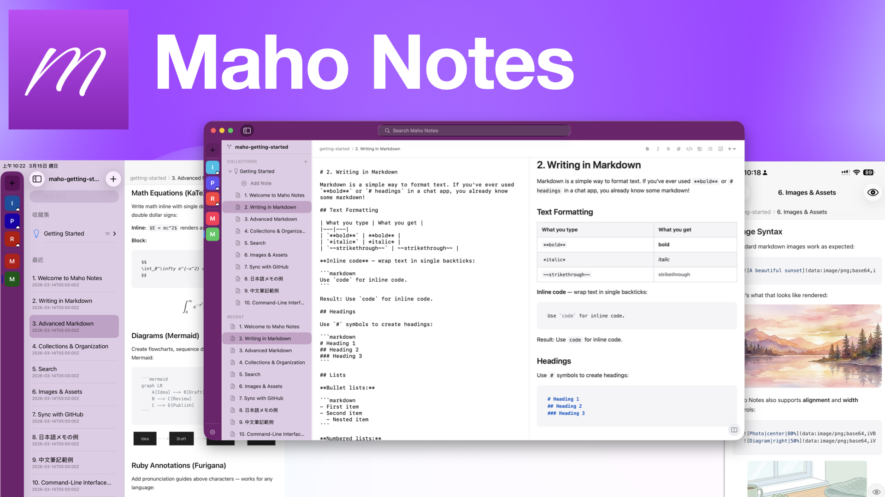

# 1. Welcome to Maho Notes

Welcome! Maho Notes is a markdown-based note-taking app designed for people who care about their words.

## What Makes Maho Notes Different

- **Markdown-first** — Your notes are plain `.md` files. No proprietary format, no lock-in. You own your data, always.
- **Local-first** — Notes live on your device and sync via iCloud. Nothing goes to a server you don't control.
- **Multilingual** — Full support for Chinese, Japanese, Korean, and English — including search. Write in any language, search in any language.
- **Beautiful rendering** — Math equations, diagrams, code highlighting, and even furigana (ruby annotations) — all rendered natively.

## How Notes Are Organized

Maho Notes uses a simple hierarchy:

- **Vault** — Your top-level container (like a notebook). You can have multiple vaults.
- **Collection** — A folder within a vault for grouping related notes.
- **Note** — A markdown file with a title, tags, and content.

This "Getting Started" collection you're reading right now is inside a vault!

## Next Steps

Browse through the other notes in this collection to learn the basics. When you're comfortable, feel free to delete this collection and start writing your own notes.

Happy writing! ✍️
