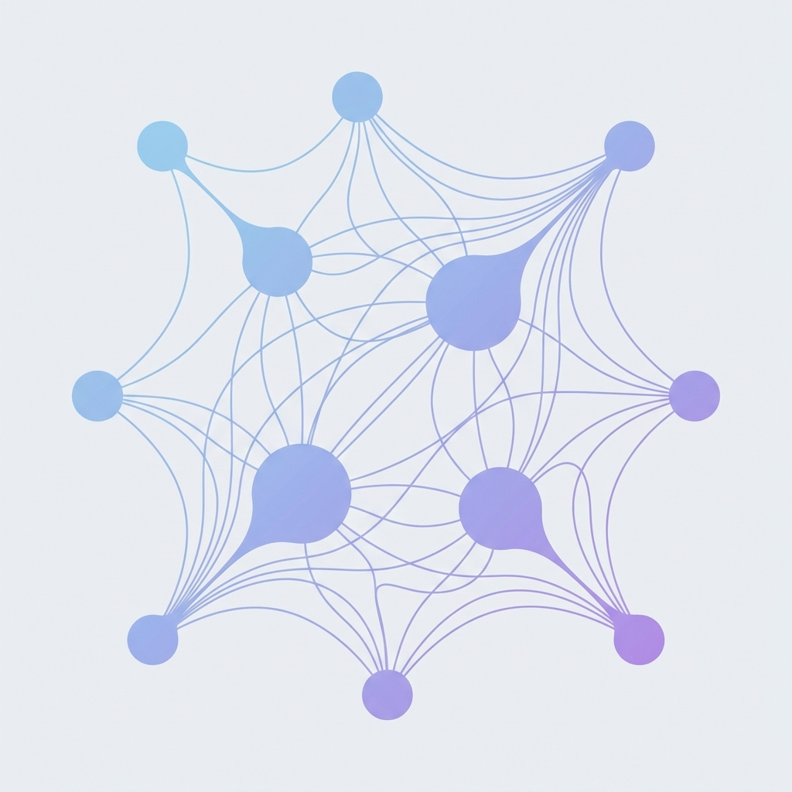

# 6. Images & Assets

Maho Notes stores images alongside your notes in an `_assets/` folder within each collection.

## Adding Images

Drag and drop an image into the editor, or paste from your clipboard. Maho Notes automatically:

1. Saves the image to the collection's `_assets/` folder
2. Inserts the markdown reference for you

## Image Syntax

Standard markdown images work as expected:

```markdown

```

Here's what that looks like rendered:


Maho Notes also supports **alignment** and **width** controls:

```markdown


```


- **Alignment**: `left`, `center`, or `right`
- **Width**: `25%` to `100%` of the content area

## Asset Management

When you move or copy a note to another collection, its referenced assets are moved or copied along with it. Your images always stay with your notes.

## Supported Formats

Maho Notes supports common image formats: PNG, JPEG, GIF, WebP, and SVG.
