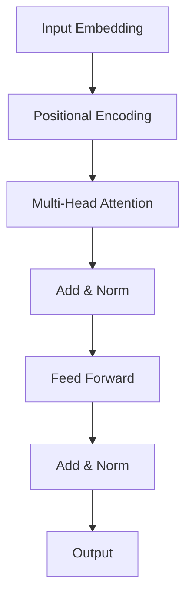

# Reading Notes & Paper Reviews

Maho Notes is great for keeping reading notes — especially for academic papers where you need math, diagrams, and structured summaries.

## Paper Review Template

---

### Paper: "Attention Is All You Need"

**Authors:** Vaswani et al. (2017)
**Link:** [arXiv:1706.03762](https://arxiv.org/abs/1706.03762)

#### Key Idea

Replace recurrence entirely with **self-attention**. The Transformer processes all positions in parallel.

#### Core Equation

Scaled dot-product attention:

$$
\text{Attention}(Q, K, V) = \text{softmax}\left(\frac{QK^T}{\sqrt{d_k}}\right) V
$$

where $Q$, $K$, $V$ are query, key, and value matrices, and $d_k$ is the key dimension.

#### Architecture Overview

#### My Takeaways

1. Positional encoding is crucial — without it, the model has no sense of order
2. Multi-head attention lets the model attend to different representation subspaces
3. The $\sqrt{d_k}$ scaling prevents softmax from saturating for large $d_k$

#### Questions / Follow-ups

- [ ] Read "BERT: Pre-training of Deep Bidirectional Transformers"
- [ ] How does relative positional encoding compare?
- [ ] Try implementing single-head attention from scratch

---

## Book Notes Template

---

### 📖 "Designing Data-Intensive Applications"

**Author:** Martin Kleppmann
**Started:** March 2026

#### Ch. 1 — Reliability, Scalability, Maintainability

> "Even if the system is working correctly today, that doesn't mean it will work correctly in the future."

Key concepts:
- **Reliability** — the system works correctly even when things go wrong
- **Scalability** — the system can handle growth (data, traffic, complexity)
- **Maintainability** — people can work with the system productively over time

#### Ch. 2 — Data Models and Query Languages

| Model      | Strength              | Example        |
|------------|-----------------------|----------------|
| Relational | Joins, consistency    | PostgreSQL     |
| Document   | Flexibility, nesting  | MongoDB        |
| Graph      | Relationships         | Neo4j          |

---

## Tips

> [!tip]
> **One note per paper/book.** Keep them in a dedicated collection like `reading-notes/` so they're easy to browse and search.

> [!note]
> Maho Notes' search works across all languages — so your notes in 中文, English, or 日本語 are all searchable.
